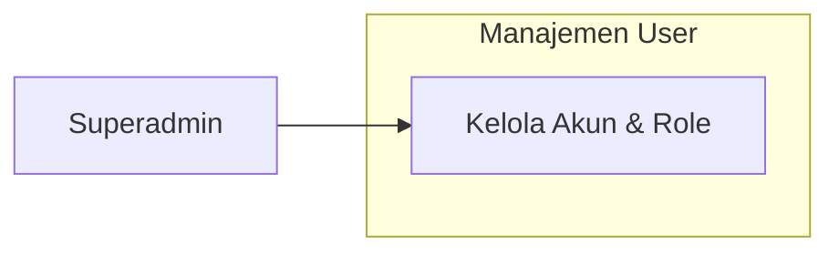
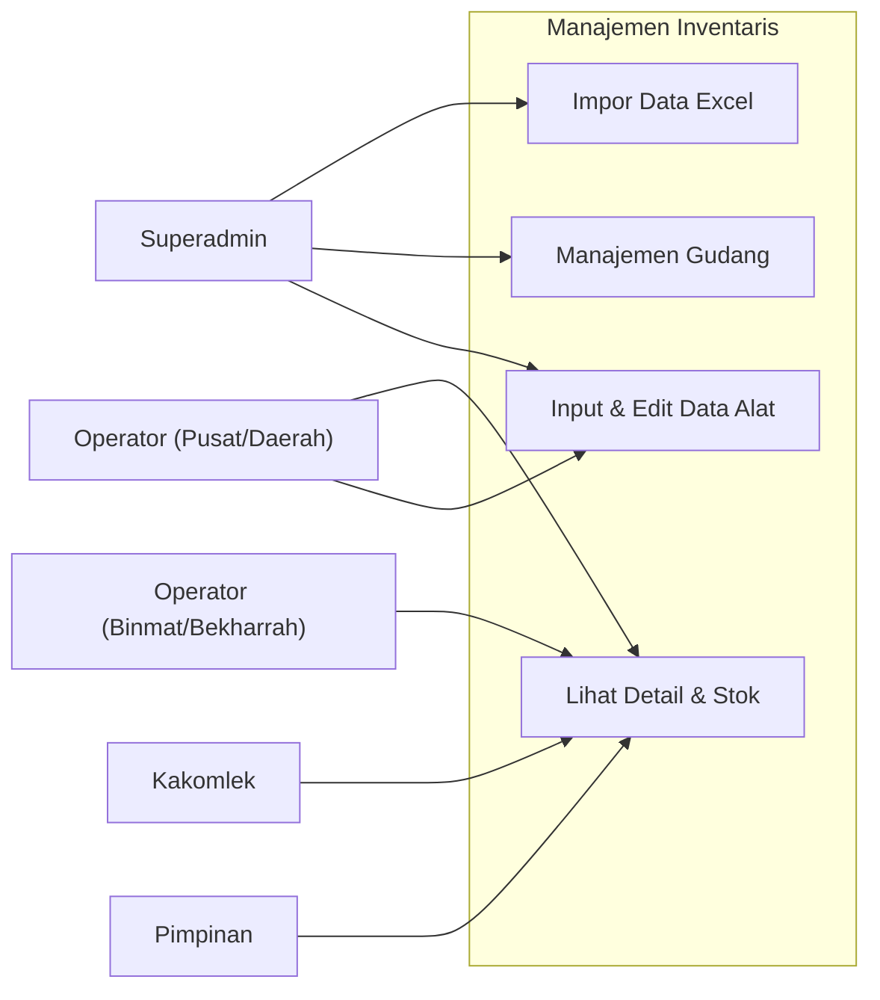
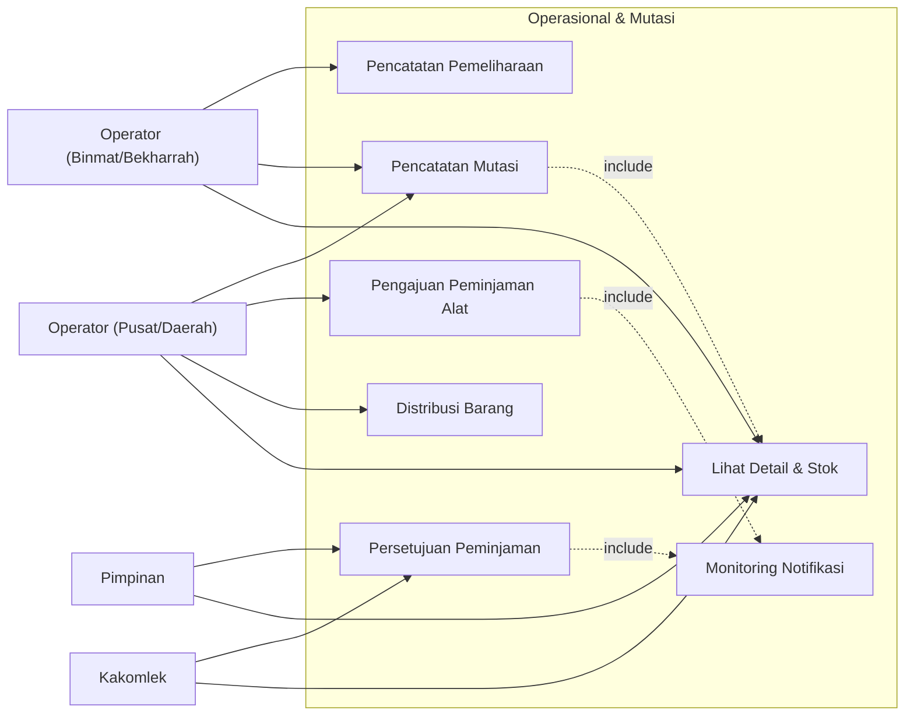
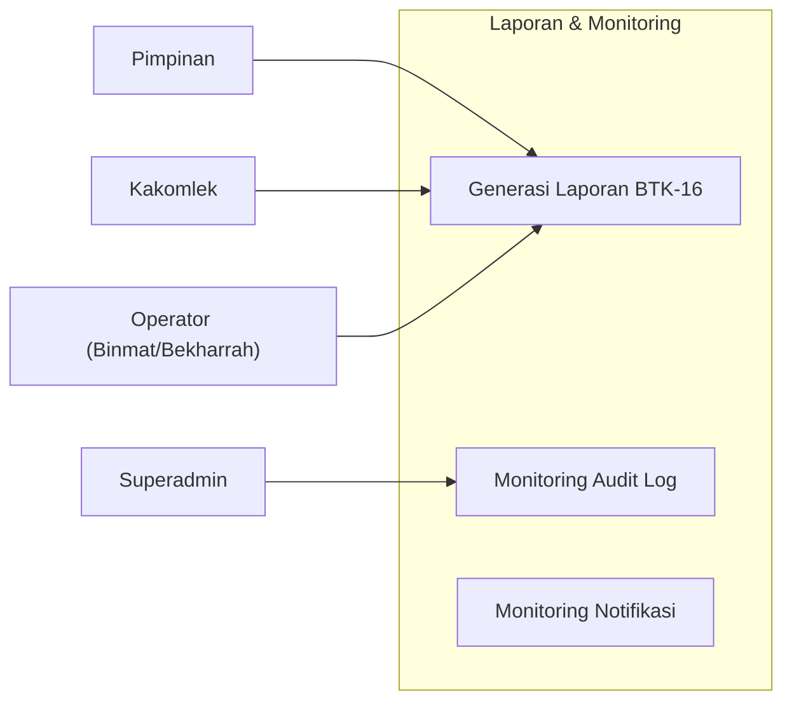

# Use Case Diagram - Sistem Inventaris Puskomlekad

Dokumen ini membagi Use Case Diagram ke dalam beberapa fitur utama agar lebih mudah dipahami.

---

## 1. Manajemen User
Fokus pada pengelolaan hak akses dan akun pengguna oleh administrator.

---

## 2. Manajemen Inventaris
Fokus pada pengelolaan data alat, gudang, dan stok material.

---

## 3. Operasional & Mutasi
Fokus pada alur kerja harian seperti peminjaman, pergerakan barang (mutasi), distribusi, dan pemeliharaan.

---

## 4. Laporan & Monitoring
Fokus pada transparansi data, audit log, dan pelaporan berkala.

---

### Daftar Aktor & Peran:
- **Superadmin**: Mengelola infrastruktur data (user, gudang, audit log).
- **Pimpinan / Kakomlek**: Melakukan pengawasan dan memberikan otorisasi (approval).
- **Operator (Pusat/Daerah)**: Pelaksana operasional inventaris dan logistik.
- **Operator (Binmat/Bekharrah)**: Pelaksana teknis pemeliharaan dan pelaporan materiil.
